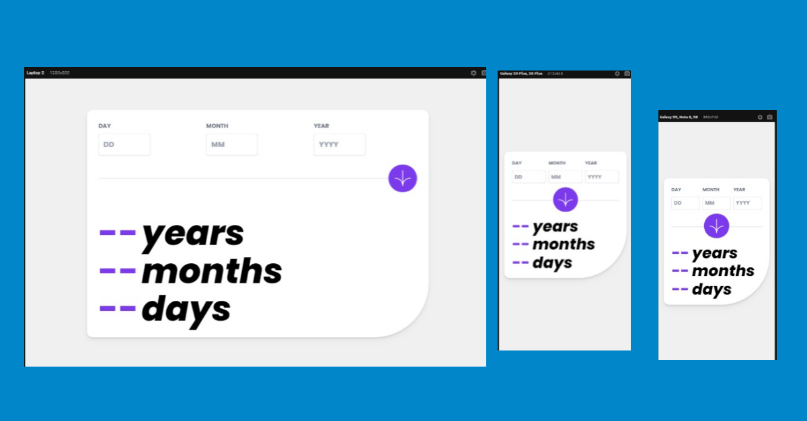

# Age Calculator with all possible validations

This is a solution to the Age calculator challenge on Frontend Mentor.
## Table of contents

- [Overview](#overview)
  - [The challenge](#the-challenge)
  - [Screenshot](#screenshot)
  - [Links](#links)
- [My process](#my-process)
  - [Built with](#built-with)
  - [What I learned](#what-i-learned)
  - [Continued development](#continued-development)
  - [Useful resources](#useful-resources)
- [Author](#author)

## Overview

### The challenge

Users should be able to:

- Add their the correct date of birth
- See a Calculated age up to today date after successfully submitting the form
- See form validation error messages if:
  - The field is left empty
  - The date, month or year of birth is not formatted correctly

- View the optimal layout for the interface depending on their device's screen size
- See hover and focus states for all interactive elements on the page

### Screenshot

### Links

- Solution URL: [github](https://github.com/Naveed89-tech/Age-Calculator)
- Live Site URL: [Age Calculator](https://age-calculator-32.netlify.app/)

## My process

### Built with

- Tailwind CSS 
- FormWik ( Form validation manually)
- CSS flex 
- [React](https://reactjs.org/) - JS library

### What I learned

The project initially seemed simple, but since I am currently learning React, I decided to develop it using React . I found it easier to perform validation using the 'useState' hook in React. However, as I am currently exploring the 'Formik' form react liabray [https://formik.org/docs/overview], I decided to utilize it for my project, particularly for implementing live form validation. Now, the form aligns perfectly with my vision and goals for the project.

## About Formik Introduction
Let's face it, forms are really verbose in React. To make matters worse, most form helpers do way too much magic and often have a significant performance cost associated with them. Formik is a small library that helps you with the 3 most annoying parts:

1.  Getting values in and out of form state
2.  Validation and error messages
3.  Handling form submission

### Continued development

As I continue to progress in my journey of learning React, I plan to primarily focus on utilizing the different libraries  in my future projects. I firmly believe that learning by doing is the most effective approach to gaining a better understanding of complex concepts. By actively applying and experimenting with formik, I aim to deepen my knowledge and proficiency in React development.

### Useful resources

- [React.dev](https://react.dev/reference/react) - This helped me to understanding concepts
- [Formik](https://formik.org/docs/overview) - This helped me to understanding concepts
## Author

- Website - [Naveed](https://naveedtechs.netlify.app/)
- Twitter - [@Naveed_Tech_T](https://twitter.com/Naveed_Tech_T)
- LinkedIn- [Muhammad Naveed](https://www.linkedin.com/in/muhammad-naveed-857600231/)
- Frontend Mentor - [@Naveed89-tech](https://www.frontendmentor.io/profile/Naveed89-tech)
